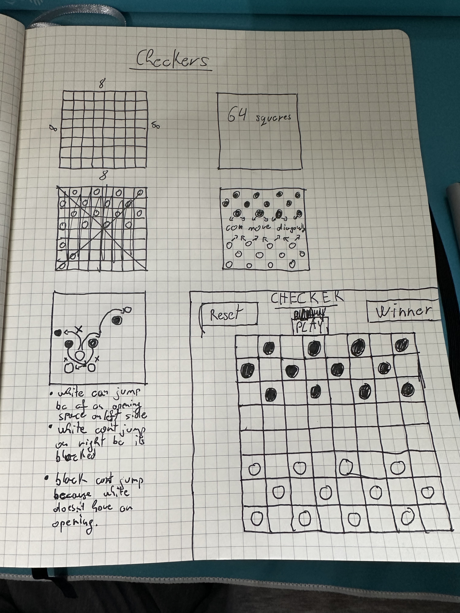

G-project aka Checkers game
// building a checkers game involves having a board with 64 squares (8x8) and alternating dark and light color.

// we will start by making the board first and assigning the boxes by their own value and creating the colors they were meant to have.

//also need the board pices to play so we would make 24 pieces that are disk-shaped. Each player gets 12 pieces.

//the board will only have 32 squars to play with, within the darker colors thats where the players will be able to compete agains one another.

//the board pices can only move diagonally in any direction they have room to move and 1 square at a time.

//the board pices can also move over the opponets boards pices if they have an empty slot behind them and they will eliminate one of their board pices there could be more the one empty spot and you can eliminate more pices on the board jumping over them. 

//how to win: once all the board pices are eliminated or blocked where the opponents cant make a move you will win the game.

//as a user, i want the ability to..

- start button to play
- white moves first
- move left or right and you can only go forward 
- rotate the players turn (black turn)
- capture piece by having an empty space to jump over a player
- you can have multiple jumps over a player if there is a second piece availbe with an empty space behind it 
-keep roating turns until you reach the other side of the board where you are safe
-player with the most pices left and no more moves to be made by either party will be declared the winner

-

